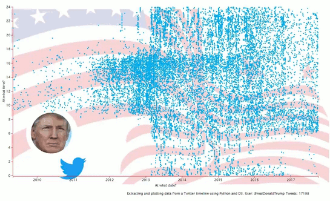

Twitter user timeline and time activity patterns using D3
=========================================================

I've just gathered about 17,000 Tweets (no retweets) from @realDonaldTrump and I'm performing a plot on the time activity patterns of the user.

It uses Python to get the Tweets (source not included in this Git) and extracts the data and D3 to show them.

